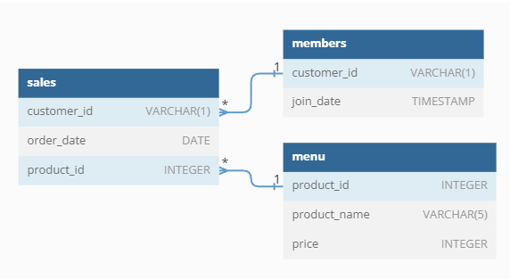

# case-study

## Description
Used the Danny's diner data from 8weelsqlchallenge.com for the case study. It contained the following 3 key datasets: 
* Sales
* Menu
* Members
Below image depicts database schema of the case study:

  
  In this schema, the "Sales" table represents the fact table, as it contains the transactional data capturing the sales information. The "Menu" and "Members" tables are dimension tables, as they provide additional descriptive information about the products and customers, respectively.
* The sales table captures all customer_id level purchases with an corresponding order_date and product_id
information for when and what menu items were ordered.
* The menu table maps the product_id to the actual product_name and price of each menu item.
* The final members table captures the join_date when a customer_id joined the beta version of the Danny’s Diner
loyalty program.  

Case study qusetions:
1. What is the total amount each customer spent at the restaurant?
1. How many days has each customer visited the restaurant?
1. What was the first item from the menu purchased by each customer?
1. What is the most purchased item on the menu and how many times was it purchased by all customers?
1. Which item was the most popular for each customer?
1. Which item was purchased first by the customer after they became a member?
1. Which item was purchased just before the customer became a member?
1. What is the total items and amount spent for each member before they became a member?
1. If each $1 spent equates to 10 points and sushi has a 2x points multiplier - how many points would each customer have?
1. In the first week after a customer joins the program (including their join date) they earn 2x points on all items, not just sushi - how many points do customer A and B have at the end of January?  

The above questions were solved by implementing SQL queries that utilized various SQL techniques including joins, CTEs (Common Table Expressions), subqueries, window functions (e.g., ROW_NUMBER, DENSE_RANK), aggregate functions, and CASE statements.

